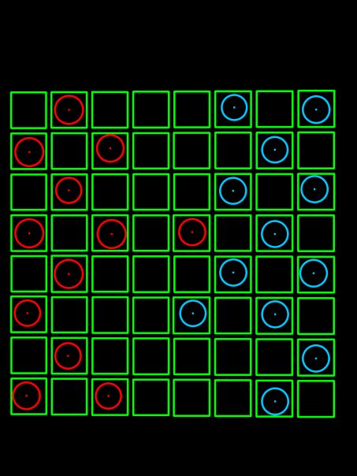
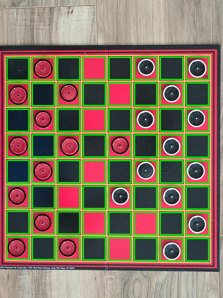

# Description
This is an "Augmented Reality" way of playing checkers! It works by taking a picture of a checker board, adding it to the directory, and then
OpenCV reads that image, spits that info into a MiniMax checker AI, then that spits back a desired position, where the user physically moves
the computers piece, and then their piece again.

This process repeats until a sole victor remains.

## Example Images

First take an image:

We then Convert this image into two separate images:

1. We convert into grayscale, and apply a median
blurring filter for detecting circles. The circles
are found using the Hough circle transform.

2. We convert to HSV and threshold to a value that
equates to the yellow lines on the board. This allows
us to use a Canny edge detector to find all the squares
in the image. This will be important for feeding the AI
our move.

From the image below, we can find the rectangles by first finding
the countours of all the closed areas, and the creating a bounding
rectangle around the contours. Since all the squares are about the
same size, we can just filter the bounding rectangles by a certain
width and height, so that we don't pickup other bounding rectangles
that are not spaces in the checkerboard ( Like the board itself! ).

We can then apply our outputs from the canny edge detection,
as well as the outputs to our Hough transform onto a blank canvas.
This was extreamly useful for debugging and tweaking the different
values to our system.

Here is the debug information overlayed with the final image:

And finally, we can detect where the pieces are simply by indexing through
each rectangle, and then just indexing through each circle. If the center of the
circle is in the rectangle and the overall intensity equates to red, its a red piece,
else its a black. If no center is found, the square is empty.

When we feed this to the AI, it spits out it's move. The cool thing about this is that since
we have our boards state from our image processing program, when we get the move from the AI,
we can draw this onto the screen so the user knows which piece to move:

And then we make our next move, and the process repeats again.

## How to run
The user moves first.

1. Run ` python checkers.py `.
2. Move your piece, take a picture, and save it in the same directory as ` game.jpg `. Press any button to continue.
3. A series of images will popup. Press any button on the images to continue.
4. The AI will display it's move on screen. Move the piece to where the AI wants. Press any button on the image to continue.
5. Go to step 2

If you don't have the exact checkerboard and the exact camera, this setup doesn't exactly work (Ha).  
I have therefor saved a series of Step 2s game.jpgs in the folder OurMoves so someone else who wants to see this program
in action can still see how it all works for themselves.

## Requirements
Opencv
Numpy
Python

### Small Note
The Algorithm that was used in this project was not made by us, and can be found here: 
https://github.com/ivanmrsulja/checkers-bot

This project was mainly for the purpose of learning about image processing techniques, and not AI.
We decided to just borrow an AI just to see if our Image Processing techniques would work when we move 
the pieces around.

We did however need to tweak this program in order to take in the output to our image processing
program. It originally takes in the user's move from the command line. We just tweaked this so that
it took the player's move from the image processing program.

