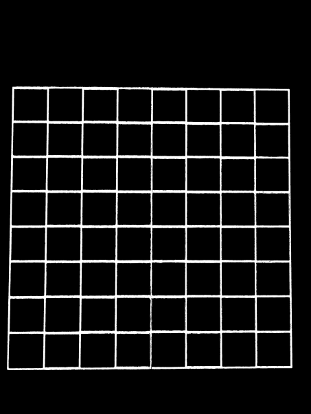

# Description
This is an "Augmented Reality" way of playing checkers! You play against an AI, where
in order to input your moves, you take a picture of a real life checkers board. The AI
then uses the MiniMax algorithm to display that same image, except that it will draw a line
where it wants to move.

This process of picture taking repeats until a sole victor remains.

Example here:
https://www.youtube.com/watch?v=DWDR86CJD-Q

## Example Images

First take an image of our move:

We then Convert this image into two separate images:

1. We convert into grayscale, and apply a median
blurring filter for detecting circles. The circles
are found using the Hough circle transform.

2. We convert to HSV and threshold to a value that
equates to the yellow lines on the board. We then
dilute those rectangle lines to get a more easily readable
grid of rectangles.

This whole process allows us to use a Canny edge detector 
to find all the squares in the image. These squares will
represent the spaces on the checkerboard.

Converting to HSV:

We use the image above to threshold by the intense yellow value
seen along the lines of the checkerboard.

From the image above, we can find the rectangles by first finding
the contours of all the closed areas. We can then create a bounding
rectangle around all contours. Since all the squares are about the
same size, we can just filter the bounding rectangles by a certain
width and height, so that we don't pickup other bounding rectangles
that are not spaces in the checkerboard ( Like the board itself! ).

We can see also why we dilute the pixels of the image. We need the rectangles
to be enclosed in order for our contour method to detect the shape.

We can then apply our outputs from the canny edge detection,
as well as the outputs to our Hough transform onto a blank canvas.
This was extremely useful for debugging and tweaking the different
values of our system.

Here is the debug information overlayed with the final image:

We can then detect where the pieces are simply by indexing through
each rectangle. For every rectangle, we just index through all the circles
to see if a center dot is within the bounds of that rectangle. If the center of a
circle is within the bounds of the rectangle and the overall intensity equates to 
red, its a red piece, else it is a black piece. If no center is found, the square is empty.

When we feed this to the AI, it spits out a chosen move. The cool thing about this is that we
also save the previous board state in code, so when we get the move from the AI,
we can draw this onto the screen so the user knows which piece to move:

Finally we move the AIs piece, then make another move ourselves.
We then take a picture, and repeat the process from the beginning.

## How to run
The user moves first.

1. Run ` python checkers.py `.
2. Move your piece, take a picture, and save it in the same directory as ` game.jpg `. Press any button to continue.
3. A series of images will popup. Press any button on the images to continue.
4. The AI will display it's move on screen. Move the piece to where the AI wants. Press any button on the image to continue.
5. Go to step 2

If you don't have the exact checkerboard and the exact camera, this setup doesn't exactly work (Ha).  
I have therefor saved a series of Step 2s game.jpgs in the folder OurMoves so someone else who wants to see this program
in action can still see how it all works for themselves.

## Requirements
Opencv
Numpy
Python

### Small Note
The Algorithm that was used in this project was not made by us, and can be found here: 
https://github.com/ivanmrsulja/checkers-bot

This project was mainly for the purpose of learning about image processing techniques, and not AI.
We decided to just borrow an AI just to see if our Image Processing techniques would work when we move 
the pieces around.

We did however need to tweak this program in order to take in the output to our image processing
program. It originally takes in the user's move from the command line. We just tweaked this so that
it took the player's move from the image processing program.

